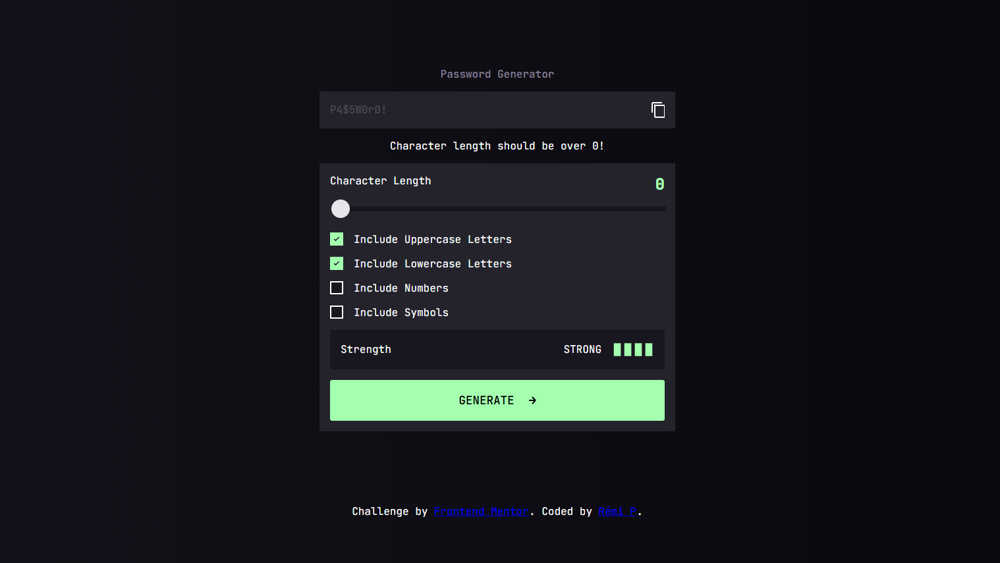

# Frontend Mentor - Password generator app solution

This is a solution to the [Password generator app challenge on Frontend Mentor](https://www.frontendmentor.io/challenges/password-generator-app-Mr8CLycqjh). Frontend Mentor challenges help you improve your coding skills by building realistic projects. 

## Table of contents

- [Overview](#overview)
  - [Screenshot](#screenshot)
  - [Links](#links)
- [My process](#my-process)
  - [Built with](#built-with)
  - [What I learned](#what-i-learned)
- [Author](#author)

## Overview

### Screenshot

### Links

 Live Site URL: [Vercel](https://frontend-tip-calculator-five.vercel.app/)

## My process

### Built with

- Semantic HTML5 markup
- CSS custom properties
- CSS Flex
- Mobile-first workflow
- SCSS

### What I learned

- Familiarizing with CSS Flex
- CSS BEM (Block Element Modifier) structure attempt
- Usage of SCSS
- Mobile-first styling
- Refactoring in JS
- Working with SVG icons
- Custom slider modifications in css
- Usage of npm and importing library
- CSS variables and modifying with JS
- Usage of Objects and arrays in JS
- Usage of JS functions

## Author

- Frontend Mentor - [@RemiPish](https://www.frontendmentor.io/profile/RemiPish)